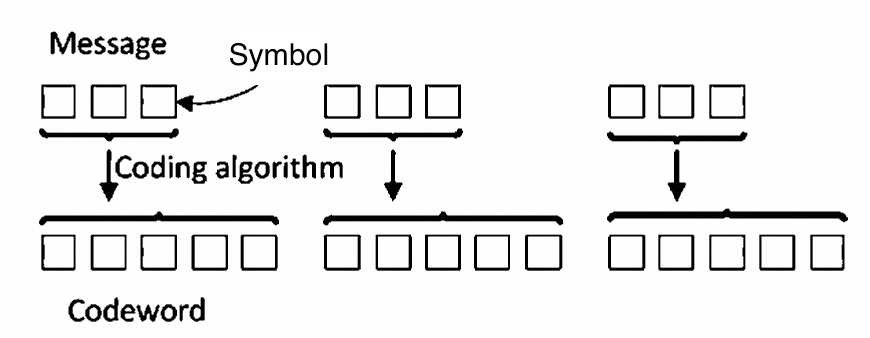

在计算、电信、信息论和编码理论中，**ECC（Error Control Code/Error Correction Code）**，或者 **前向纠错（FEC/Forward Error Correction）** 或 **信道编码（Channel Code）** 差不多说的都是同一个东西——一类用于在不可靠或噪声通信信道中数据传输信息并减少错误的技术。美国数学家 _理查德·卫斯里·汉明（Richard Wesley Hamming）_ 在 1940 年代开创了这一领域，并于 1950 年发明了第一个纠错码：**汉明 (7, 4) 码**。

[据说](https://en.wikipedia.org/wiki/Hamming_code)汉明 1940 年代末期在贝尔实验室工作，需要用到 Bell Model V 计算机。这是一台机电继电器式计算机，循环时间以秒为单位，通过打孔纸带输入数据和指令。纸带宽七分之八英寸，每行最多六个孔。计算机检测到错误时，机器会停止并闪烁灯光，在工作日时就会有操作员来纠正问题。但是在下班时间或周末没有操作员时，机器就只能停在那里了。汉明经常在周末工作，被整得有点破防。因为检测到错误后就必须从头开始重新启动程序。在一次录音采访中汉明说：“该死的，如果机器可以检测到错误，为什么不能定位错误的位置并纠正它？”在接下来的几年里，他致力于纠错问题，开发了一系列越来越强大的算法。1950 年，他发表了现在被称为汉明码的内容，至今仍在 ECC 内存等应用中使用。

让我先从最简单的汉明 (7, 4) 码开始入门。

## 汉明 (7, 4)码

### 概述

汉明 (7, 4)码工作在二级制数据上（即 0/1 比特），它对每 4 个待编码的比特添加 3 个比特的校验码，变成 7 比特。这也是它为什么被称为（7, 4）编码。我们设这 4 个待编码的数据比特为 $[d_0, d_1, d_2, d_3]$。进行编码后，编码器添加的 3 个比特为 $[p_0, p_1, p_2]$。计算公式为（为方便说明和理解，相较于原始的论文有所修改）：

$$
\begin{align}
p_0 &= d_0 \oplus d_1 \oplus d_2 \\
p_1 &= d_1 \oplus d_2 \oplus d_3 \\
p_2 &= d_0 \oplus d_1 \oplus d_3 \\
\end{align}
$$

其中 $\oplus$ 为异或运算符。

得到的这 7 个比特会写在纸带上，计算机读取到信息之后会进行校验：

$$
\begin{align}
s_0 &= d_0 \oplus d_1 \oplus d_2 \oplus p_0 \\
s_1 &= d_1 \oplus d_2 \oplus d_3 \oplus p_1 \\
s_2 &= d_0 \oplus d_1 \oplus d_3 \oplus p_2 \\
\end{align}
$$

$s_0, s_1, s_2$ 被称为校验得到的**伴随式**（Syndrome）。Syndrome 直译过来是“综合症”，有些时候也被翻译成“校验值”。之所以叫这个名字，是因为接下来的过程计算机就需要（并且仅需要）根据这 3 个比特判断读取到的数据是否有错误。有点像老中医把下脉就知道你身体哪儿出问题了。

显然，若传输过程中未出错，则 $s_0 = s_1 = s_2 = 0$。

现在来看当传输过程中出现了 1 比特错误会发生什么：假设错误位于 $d_0$，则 $s_0 = s_2 = 1, s_1 = 0$（注意：二进制比特的“一个错误”表示该比特被反转了），或者说 $[s_0, s_1, s_2] = [1, 0, 1]$。如果这 1 比特错误发生在校验位 $p_0$ 上，我们同样可以得到 $[s_0, s_1, s_2] = [1, 0, 0]$。

我们可以很容易枚举这 1 比特错误发生在不同位置时，产生的伴随式的值：

| 错误位置 | $[s_0, s_1, s_2]$ |
| -------- | ----------------- |
| $d_0$    | $[1, 0, 1]$       |
| $d_1$    | $[1, 1, 1]$       |
| $d_2$    | $[1, 1, 0]$       |
| $d_3$    | $[0, 1, 1]$       |
| $p_0$    | $[1, 0, 0]$       |
| $p_1$    | $[0, 1, 0]$       |
| $p_2$    | $[0, 0, 1]$       |

站在上帝的角度，假如我们知道传输的过程中产生了几个比特的错误：

- 只发生了 1 比特错误：接收方可以根据得到的伴随式的值，然后翻转对应比特来纠正。消息长度为 7，因此存在 7 个可能的 1 比特错误位置，加上无错误的情况，刚好可以用 3 比特来表示。换句话说，汉明 (7, 4) 码把每一个可能的 1 比特错误映射成不同的伴随式的值，这点非常巧妙。
- 如果发生了 2 比特错误：我们可以遍历所有 2 比特可能的错误模式并检查结果，一共有 $C_{7}^{2} = 21$ 种。可以得到所有 2 比特错误的伴随式的值都是非零的，也就是说汉明 (7, 4) 码可以“检测 2 比特错误”。但是你可能已经发现，如果发生了 2 比特错误，得到的伴随式的值和 1 比特错误时能够得到的伴随式的值是一样的。所以其实汉明 (7, 4) 编码其实并没有办法区分到底是错了 1 个比特还是错了 2 个比特。
- 如果发生了更多的错误：情况变得更糟，甚至可能会出现计算出来伴随式的值为 0 的情况（凑巧把伴随式的值凑成了 0）。也就是说错误比特数达到 3 及以上之后，我们可能都没有办法发现有错。

对于接受方来说，它的处理策略应该是：

- 计算出伴随式为 0：“认为”接受到的数据是正确的。
- 伴随式的值非 0：按照 1 比特错误来纠正。

可以看到错误数量大于等于 2 比特的时候，汉明 (7, 4) 解码器就会得出错误的结果。实际上大多数时候解码器并不知道错误比特数，这时不论是它纠错还是给出数据是正确的结论，都是有风险的。但对解码器来说其实也没有更好的办法了，只能认定发生 2 个或者更多比特错误是小概率事件而强行给出结论。

### 矩阵形式

为了说明简便，我们把汉明 (7, 4) 码表示为矩阵形式，对应有生成矩阵与校验矩阵如下：

生成矩阵 $\bm{G}$：

$$
\bm{G} = \begin{bmatrix}
1,& 0,& 0,& 0,& 1,& 1,& 0\\
0,& 1,& 0,& 0,& 0,& 1,& 1\\
0,& 0,& 1,& 0,& 1,& 1,& 1\\
0,& 0,& 0,& 1,& 1,& 0,& 1\\
\end{bmatrix}
$$

编码计算公式：

$$
[d_3, d_2, d_1, d_0] \cdot \bm{G} = [d_3, d_2, d_1, d_0, p_2, p_1, p_0]
$$

校验矩阵 $\bm{H}$：

$$
\bm{H} = \begin{bmatrix}
1,& 0,& 1,& 1,& 1,& 0,& 0\\
1,& 1,& 1,& 0,& 0,& 1,& 0\\
0,& 1,& 1,& 1,& 0,& 0,& 1\\
\end{bmatrix}
$$

伴随式计算公式：

$$
[s_2, s_1, s_0]^T = [d_3, d_2, d_1, d_0, p_2, p_1, p_0] \cdot \bm{H}^T
$$

注意矩阵计算中的所有标量乘法都被替换成了异或运算（$\oplus$）。可以很容易验证 $\bm{G} \cdot \bm{H}^T = \bm{0}$，这是编解码非常重要的一个特征。

## 带附加校验的汉明码 - 汉明 (8, 4) 码

我们刚看到，汉明 (7, 4) 码能够纠正 1 比特错误，但是又会混淆 1 比特和多比特错误。那么如何让这个纠错算法更“强大”呢？我们在汉明 (7, 4) 码的基础上添加一个额外的整体校验位，就可以轻松扩展为汉明 (8, 4) 码。额外的比特使整个码字保持偶校验。扩展后的汉明 (8, 4) 码的生成矩阵与校验矩阵如下：

$$
\bm{G} = \begin{bmatrix}
1,& 0,& 0,& 0,& 1,& 1,& 0,& 1\\
0,& 1,& 0,& 0,& 0,& 1,& 1,& 1\\
0,& 0,& 1,& 0,& 1,& 1,& 1,& 0\\
0,& 0,& 0,& 1,& 1,& 0,& 1,& 1\\
\end{bmatrix}
$$

$$
\bm{H} = \begin{bmatrix}
1,& 0,& 1,& 1,& 1,& 0,& 0,& 0\\
1,& 1,& 1,& 0,& 0,& 1,& 0,& 0\\
0,& 1,& 1,& 1,& 0,& 0,& 1,& 0\\
1,& 1,& 0,& 1,& 0,& 0,& 0,& 1\\
\end{bmatrix}
$$

大家可以尝试一下，与汉明（7, 4）码相比，当发生 2 比特错误时，伴随式的输出与 1 比特错误的输出不同。也就是说 1 比特错误和 2 比特错误被编码成不同的伴随式输出。这样解码器就可以“安全”地纠正 1 比特错误，同时检测 2 比特错误（但无法纠正）。显然汉明 (8, 4) 编码相较于汉明（7, 4）有更好的抵抗错误的能力。汉明 (8, 4) 编码能够“识别”出 2 比特错误，而汉明（7, 4）却会和 1 比特错误混淆。至于错了更多比特的情况，他们都无能为力。

这种扩展汉明码在 20 世纪的计算机存储系统中非常流行，被称为 SECDED（Single Error Correction, Double Error Detection，即单比特错误可纠、双比特错误可检）。如今，许多计算机系统不再使用汉明最初的方法，通常采用更长的码字，但仍保持 SECDED 级别的保护。比如大多数计算机的 ECC 内存都提供 SECDED 级别的编码，但具体编码方式与实现可能不同。另一个例子是赛灵思（Xilinx）FPGA 系列在其 BRAM 中使用的扩展汉明 (72, 64) 码，也是 SECDED。

## 一般的汉明码

上述的汉明 (7, 4) 是一种简单的汉明码，对于一般的汉明码，有下面的一些参数：

- 码字块长：$n = 2^m - 1$，其中整数 $m \geq 2$
- 消息长度：$k = 2^m - m - 1$

| 码字长度 $n$ | 消息长度 $k$ | 码率 $R$                |
| ------------ | ------------ | ----------------------- |
| 3            | 1            | $1/3 \approx 0.333$     |
| 7            | 4            | $4/7 \approx 0.571$     |
| 15           | 11           | $11/15 \approx 0.733$   |
| ...          |              |                         |
| $2^m-1$      | $2^m-m-1$    | $\frac{2^m-m-1}{2^m-1}$ |

至于每个 $n$ 取值时具体的汉明码如何构建，以及具体公式就不在此赘述了。读者真的需要用到的时候再去研究和查公式即可。给每种汉明码添加 1 比特奇偶检验位即可得到扩展的汉明编码。

## 为什么 FEC 有效

再回到 FEC 的话题，FEC 能够不单单检测，还能纠正在数字通信系统中传输消息时发生的错误，是因为编码器不仅传输信息符号，还传输额外的冗余符号。FEC 的核心思想是以冗余方式对消息进行编码，解码器使用冗余符号解读接收到的内容。冗余允许接收方不仅检测，并且可能纠正有限数量的错误。从通信的角度来说，FEC 通过将信息和噪声“平摊”到每个传输的符号上来工作，即使部分符号损坏，仍然可以从其他符号中提取原始消息。根据香农理论，使用更多带宽来传输更少的信息，就可以承受更多噪声。

既然有 FEC，相对的应该还有 BEC（Backward Error Correction/反向纠错，虽然基本没人这么叫）。即接受方检测到错误之后请求发送方重传。显然相比于重传，FEC 的优点是不需要反向信道来发送重传请求，而缺点是会占用固定的信道带宽。

## FEC 的类型

FEC 或者说 ECC 大约可以分为两类：分组码（Block Coding）和卷积编码（Convolution Coding）。

**分组码**将固定数量的消息符号映射到固定数量的编码符号。分组码独立处理每个数据块，因此它是一个无记忆系统。

一些常见的分组码包括：

- BCH 码：ECC 内存/硬盘/嵌入式系统
- Reed-Solomon（RS）码：光纤/以太网/RAID/DVB
- LDPC：Wi-Fi/5G 共享信道/DVB
- 极化码：5G 控制信道/物联网

**卷积码**是一个有记忆系统，它也接受固定数量的消息符号并产生固定数量的编码符号。但其计算过程不仅取决于当前输入集，还取决于一些先前的输入符号。

一些常见卷积码有：

- Viterbi 码：GSM/WCDMA/卫星通信
- Turbo 码：卫星/3G/4G/WiMAX

我对卷积码不熟悉，[后续的文章](./fec-2.md)里我会介绍一下分组码的原理和常见的分组码。
