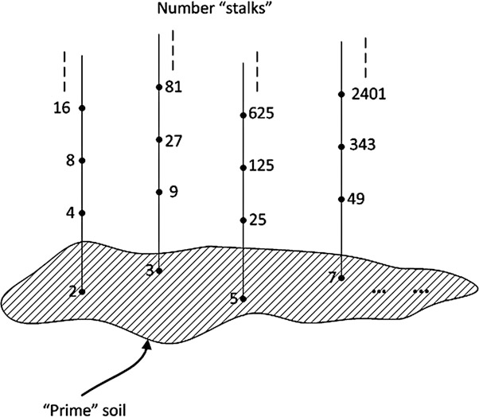
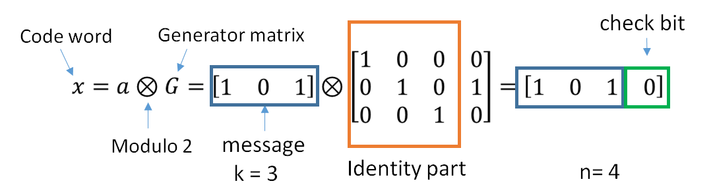

[上篇文章](./fec-1.md)中我们提到了分组码。分**组码（Block Code/块编码）**是纠错编码的一种。它将固定数量的消息符号映射到固定数量的编码符号。它独立处理每个数据块，因此是一个无记忆系统。

## 初看分组码

我们不妨用更统一更正式的形式表示分组码：对于分组码，**原始消息**和**编码之后的消息**都由 $q$ 个符号的 **“符号表”** 组成。原始消息长度 $k$，经过编码之后的消息（码字）长度 $n$。

原始消息是一个向量，表示为：

$$
\bm{d} = (d_{k-1}, d_{k-2}, ..., d_1, d_0)
$$

编码之后的码字同样是一个向量，表示为：

$$
\bm{c} = (c_{n-1}, c_{n-2}, ..., c_1, c_0)
$$

并且有 $k < n$，以及 $d_i, c_j \in \Sigma_q$。

这其中的“符号表”的表述有点奇怪。举个例子：如果 $q=2$，也就是说这个符号表里有两个符号，其实就是二进制 0 和 1。大部分情况下我们其实都是针对二进制数据进行编码，但是在**里德·所罗门（Reed-Solomon/RS）编码**的时候情况会有一些不一样。

- 符号表（字母表）：$\Sigma_q$
- 消息长度：$k$
- 块长度：$n$
- 码率：$R = k / n$

编码算法可以看成消息集和码字集之间的映射。或者说将 $r$ 维空间中的向量映射到 $n$ 维空间中的向量。

显然，这个映射应该具有一些属性：

- 一对一映射，不同的消息应该映射到不同的码字。这样消息才能成功转换回来
- 每个消息都有对应的码字，但不是每个码字都有对应的消息

严格来说，那些有对应消息的向量被称为码字（Codeword）或者为了强调而叫做**合法的码字**，通常记为 $C$。而所有的字（Word）中那些没有被映射的就称为**非法的码字**。所谓的编码算法（Code）就是这个映射。那么现在设计一个编码算法需要解决的问题就是：

- 如何在所有 Word 的集合中选择码字？
- 如何设计消息和码字之间的映射？
- 如果发生错误，如何获得正确的原始消息？

比如，我们用某种办法随机选出来 $q^k$ 个码字然后和消息随机做个一一映射，这其实就是一种编码算法。但是这么做译码器就难办了：如果接收到的码字有错，想要还原原始的消息就有些抓瞎。另外随机选这么一组映射，也没有办法回答“这种编码方式的纠错是多大？能否安全纠多少比特错误？”诸如此类的问题。

为此我们引入一些概念：

### 汉明距离

**汉明距离**是指两个等长字符串或向量在对应位置上不同符号的数量。例如字符串 `abcd` 和 `abce` 的汉明距离为 1，因为他们有对应位置上有一个字符不一样。对于二进制字符串，就是对应位置 1/0 不一样的数量。

### 最小汉明距离

**最小汉明距离**或**最小距离**（通常记为 $d_{min}$）是码字集合 $C$ 的最小距离：

$$
d_{min} = \min_{x,y \in C: x \neq y}{d(x, y)}
$$

其中 $d(x, y)$ 是 $x$ 与 $y$ 的汉明距离。显然，我们设计一种编码方式，我们应该希望它的码字集合 $C$ 的最小汉明距离尽可能大。因为更大的 $d_{min}$ 就代表码字之间长的更“不像”，因此传输中出现错误时，更容易看出其错误。$d_{min}$ 越小，则越可能出现少数的错误就让一个合法码字变成了另一个合法码字，从而分辨不出错误。

### 辛格顿上界（Singleton 界）

Singleton 界以美国数学家 _Richard Collom Singleton_ 命名，是对任意分组码 $C$ 的最小汉明距离 $d_{min}$ 大小的相对粗略的上界。对于 $GF(q)$ 上的线性码，Singleton 界有：

$$
d_{min} \leq n-k+1
$$

满足此条件的编码称为极大距离可分码。

### 纠错能力上界

纠错码的纠错能力与最小汉明距离的关系有：

$$
t\leq \lfloor \frac{d-1}{2} \rfloor
$$

其中 $t$ 是可纠正错误的能力。

### 例子 - 汉明 (7, 4) 码

汉明 (7, 4) 的最小汉明距离 $d_{min} = 3$，而其可以纠正错误的能力为 $t = 1$。

为了更好的设计编码方式，我们需要对消息和符号集合再增加一些数学。

## 更多数学

为了更好的解决上述问题，我们需要为消息和符号字符和向量定义**加法**和**乘法**。在我们定义加法和乘法运算之后，消息和码字就会有一些非常好的数学特性。并且我们需要引入**伽罗华域（Galois Field）**的概念。

### 伽罗华域（Galois Field）

**伽罗华域**的名字来源于法国数学家埃瓦里斯特·伽罗华。有时被简称为**域**，它是一个集合 $F$，并在其上定义了加法（$a+b$）和乘法（$a\cdot b$）两种运算。并且定义的加法和乘法满足一些特性（定律）：

- **结合律**：$a+(b+c)=(a+b)+c$，$a\cdot(b\cdot c)=(a\cdot b)\cdot c$
- **交换律**：$a+b=b+a$，$a\cdot b=b\cdot a$
- **分配律**：$a\cdot(b+c)=(a\cdot b)+(a\cdot c)$
- **存在加法与乘法恒等元**：存在两个**不同**的元素 $\bold{0}$ 和 $\bold{1}$ 属于 $F$，使得 $a+\bold{0}=a$ 且 $a\cdot\bold{1}=a$
- **存在加法逆元**：对每个 $a\in F$，存在元素 $-a\in F$，使得 $a+(-a)=\bold{0}$
- **存在乘法逆元**：对每个 $a\neq\bold{0}$ 且 $a\in F$，存在元素 $a^{-1}$ 或 $1/a$，使得 $a\cdot a^{-1}=\bold{1}$

由于每个元素 $a$ 都有加法逆元 $-a$，每个非零元素 $b$ 都有乘法逆元 $b^{-1}$。因此可以定义减法 $a-b$ 与除法 $a/b$。注意减法和除法只是“语法糖”，不属于定义的一部分。

此外运算封闭，即加减乘除的结果仍在该域内。域是一种基础的代数结构，广泛应用于代数、数论以及数学的其他领域。我们有一些熟知的域：

- 有理数 $\mathbb{Q}$
- 实数 $\mathbb{R}$
- 复数 $\mathbb{C}$

而整数集 $\mathbb{Z}$ 它不是一个域，因为它没有乘法逆元。

### 有限域（Finite Field）

有限域是含有有限个元素的域，其元素数量也称为**域的阶**。有限域的阶（或集合大小）通常记为 $q$。并且可以证明，有限域的阶必然为“素数的正整数幂”这样的形式，即 $q=p^m$，其中 $p$ 为素数，$m$ 为正整数。相应地，有限域可分为两类：

- $m =1$，此时域被称为**本原域（Prime Field）** $GF(p)$
- $m\ge2$，此时域被称为**扩展域（Extension Field）** $GF(p^m)$

有限域有一个重要的性质叫**同构性**：阶数相同的有限域都是**同构**的。同构的意思是说存在一种一一映射，让这个域里的每个元素可以映射到另一个域的各个元素上。并且经过加减乘除之后仍然满足这个映射关系。说起来很绕口，其实就是你和我用不同的集合定义和加法/乘法定义，搞出来了两个伽罗华域，但是只要里面的元素数量是一样的，那么就没有本质不同。**在同构意义下存在唯一一个有限域**，因此我们只需用一种大家都喜欢的方法去定义上面说的“集合”和“加法/乘法”。

### 本原域（Primitive Field）

$GF(p)$ 被称为**本原域**，一个“大家都喜欢”的定义方法为：这个域的元素为整数集合 $\{0,1,2,...,p-1\}$，而加法和乘法是“对整数进行常规运算计算，然后对 $p$ 取模”。有些地方你也会看到它被表示成这样一个奇怪的形式：$\mathbb{Z}/p\mathbb{Z}$。

有些时候，为了不和普通的加法与乘法混淆，会用 $\oplus$ 显式表示在 GF 上的加法，用 $\otimes$ 表示 GF 上的乘法。如果不会产生混淆，也可能会直接用 $+$ 或 $\times$。

$$
\begin{aligned}
a \oplus b &= (a + b) \mod p \\
a \otimes b &= (a \times b) \mod p
\end{aligned}
$$

### 本原域 $GF(2)$

$GF(2)$ 是最小的有限域，因为按定义域至少有两个不同元素 $\bold{0}$ 和 $\bold{1}$。此时加法可简化为 **XOR**，乘法简化为 **AND**。

### 本原元素（Primitive Element）

有限域有一个非常有意思的性质：$GF(p)$ 必定存在本原元素 $\alpha$，域中所有非零元素都可表示为 $\alpha^i$。由于元素数量有限，$\{0,\alpha^0,\alpha^1,\alpha^2,...,\alpha^{p-2}\}$ 即为整个域。或者说：元素 $\alpha$ 是 $GF(q)$ 的本原元素，当且仅当 $\{0, \alpha^0, \alpha^1, ..., \alpha^{q-1}\}$ 为整个 $GF(q)$。

- $\alpha$ 是 $GF(q)$ 的生成元
- $\alpha$ 是 $GF(q)$ 中的本原 $(q-1)$ 次单位根
- $GF(q)$ 的所有非零元素都可写为 $\alpha^i$ 的形式，其中 $i$ 为自然数

### 多项式（Polynomial）

$GF(p^m)$ 上的多项式 $f(x)$ 定义为：

$$
f(x) = a_k\cdot x^k + a_{k-1} \cdot x^{k-1} + ... + a_0
$$

其中：

- $k$ 为多项式的阶
- $x$ 是多项式的不定元
- $a_i, i = 0,1,...,k$ 是系数，且 $a_i\in GF(p^m)$

多项式可以进行以下运算：

- 加法与减法
- 乘法与除法
- 求值，即将 $a$ 代入多项式后求得 $f(a)$ 的值
- 求根，即求 $a \in GF(p^m)$ 满足 $f(x)=0$

对于 $GF(p)$ 上的多项式，还有一种特别的运算：

- 在扩展域 $GF(p^m)$ 中求根

这稍微有点绕，也就是虽然这个多项式系数属于 $GF(p)$，但是却求 $a \in GF(p^m)$ 满足 $f(x)=0$。这是因为 $GF(p)$ 中的元素也是 $GF(p^m)$ 中的元素，因此可以“扩展”求根的范围。

### 不可约多项式（Irreducible Polynomial）

若 $F$ 是域，一个非零且非常数的多项式在系数属于 $F$ 的前提下，若不能分解为系数仍在 $F$ 的两个非常数多项式的乘积，则称其在 $F$ 上**不可约**。需要注意的是不可约性取决于因式系数允许的范围，这就是“在 $F$ 上不可约”的含义。

### 最小多项式（Minimal Polynomial）

$GF(p^m)$ 中某元素的最小多项式，是以该元素为根、具有最小阶数的非零二进制系数多项式。即给定元素 $a$，求 $m(x)$ 使得 $m(x)$ 的阶数最小并且 $m(a) = 0$。

### 本原多项式（Primitive Polynomial）

$GF(p^m)$ 上的本原多项式是 $GF(p^m)$ 本原元素的最小多项式。换句话说，一个多项式是本原多项式当且仅当它满足：

1. 一个次数为 $m$、系数在 $GF(p)$ 的多项式 $f(x)$
2. 它的最高阶项系数是 1
3. 有一个根 $\alpha$，且 $\alpha$ 是本原元素

性质：

- 所有本原多项式都是不可约的，但不可约多项式未必本原
- 本原多项式常数项必须非零
- 除了 $GF(2)$ 上的本原多项式 $x+1$，所有其它的本原多项式的项数为奇数
- 次数为 $m$ 的本原多项式在 $GF(p^m)$ 中有 $m$ 个不同的根，且都是本原元素

### 扩展域（Extension Field）

含有 $p^m$ 个元素的域记为 $GF(p^m)$。前面我们定义 $GF(p)$ 中的元素为整数，而 $GF(p^m)$ 中的元素是则比较奇怪：$GF(p^m)$ 中的元素为 $GF(p)$ 上次数严格小于 $m$ 的**多项式**，形式为：

$$
\bm{b} = a_{m-1} x^{m-1} + a_{m-2} x^{m-2} + ... + a_1 x + a_0
$$

其中 $\bm{b}\in GF(p^m)$，而 $a_k\in GF(p)$。也就是说 $GF(p^m)$ 中的元素不是简单的数字，而是一系列多项式，并且其系数是对应本原域中的元素。

集合定义好之后，我们来定义加法和乘法：在常用定义中，运算（**加法**与**乘法**）为多项式的通常运算，然后对一个多项式 $f(x)$ 取模（取模通过**多项式长除**完成）。也就是说每个扩域都必须与一个不可约多项式 $f(x)$ 一起定义，该多项式决定域的运算。其中 $f(x)$ 是 $GF(p)$ 上次数为 $m$ 的**不可约多项式**。

$$
\begin{aligned}
a \oplus b &= (a + b) \mod f(x) \\
a \otimes b &= (a \times b) \mod f(x)
\end{aligned}
$$

有些地方你会看到它写成下述更怪的表示方法：

$$
GF(p^m) = \frac{GF(p)[x]}{<f(x)>}
$$

定义的多项式不同，运算的方法和结果也不同。但是又由于前面说的有限域的同构性，采用不同的 $f(x)$ 定义的扩展域也没有本质的不同。

通常我们选择的 $f(x)$ 不仅仅是不可约多项式，还是**本原多项式**。

扩展域也存在本原元素 $\alpha$，使得域中的每个元素都可以表示为本原元素的幂 $\alpha^i$。此外，除了多项式和本原元素的幂这两种表示方法，域中的每个元素还可以写成本原元素的多项式这样的形式：

$$
\bm{b} = a_{m-1} \alpha^{m-1} + a_{m-2} \alpha^{m-2} + ... + a_1 \alpha + a_0
$$

讲到这里可能已经有些晕了，让我来看 $GF(2^m)$，它会稍显简单一些。

### 扩展域 $GF(2^m)$

$GF(2^m)$ 是 $GF(2)$ 的次数为 $m$ 的扩域。因为 $p=2$，通常用二进制数来表示 $GF(p^n)$ 的元素，多项式各项系数用对应元素二进制表示中的比特表示。有时候会用花括号（`{}`）来强调该数表示的是域元素。又因为二进制数又可以转换为十进制，因此 $GF(2^m)$ 中的元素又可以表示为一个简单的整数（我们兜兜转转绕了一个大圈子又回来了）。

例如，$GF(2^3)$ 取不可约多项式 $f(x)=x^3 + x + 1$，其元素可用不同方式表示：

| $GF(2^3)$ 中的元素 | 二进制表示 | 十进制表示 | 指数表示*  | 本原元素表示*           |
| ------------------ | ---------- | ---------- | ---------- | ----------------------- |
| $0$                | `{000}`    | 0          | $0$        | $0$                     |
| $1$                | `{001}`    | 1          | $\alpha^0$ | $1$                     |
| $x$                | `{010}`    | 2          | $\alpha^1$ | $\alpha$                |
| $x+1$              | `{011}`    | 3          | $\alpha^3$ | $\alpha + 1$            |
| $x^2$              | `{100}`    | 4          | $\alpha^2$ | $\alpha^2$              |
| $x^2+1$            | `{101}`    | 5          | $\alpha^6$ | $\alpha^2+1$            |
| $x^2+x$            | `{110}`    | 6          | $\alpha^4$ | $\alpha^2 + \alpha$     |
| $x^2+x+1$          | `{111}`    | 7          | $\alpha^5$ | $\alpha^2 + \alpha + 1$ |

*：取 $\alpha = x = 2$

虽然 $x = 2$ 不是 $GF(2^3)$ 中唯一的本原元素，但是我们发现用 $x = 2$ 作为本原元素很多计算都很简单，多项式形式的表示和本原元素多项式的表示方法也会变的一样。实际上 $x = 2$ 是所有 $GF(2^m)$ 域的本原元素，所以一般取 $\alpha=2$

与 $GF(2)$ 类似，在 $GF(2^m)$ 中，**加法**可直接对二进制表示做按位 **XOR** 来完成。而**乘法**则稍微有些复杂，不能直接按位 **AND** 来计算。计算 $GF(2^m)$ 上的乘法可按定义来计算。或者采用通过查“指数表”来完成：

$x \otimes y = \alpha^{\log(x) + \log(y)}$

其中 $\log(\cdot)$ 是对本原元素 $\alpha$ 的对数运算。这使基于查表的 GF 运算成为可能：

1. 构造 $\log(x)$ 查找表：用元素的二进制表示得到其指数值
2. 构造 $\alpha^{x}$ 查找表：用指数值得到元素的二进制表示
3. GF 乘法通过两次 $\log(x)$ 查表和一次 $\alpha^x$ 查表完成

## 再看分组码

现在再回到分组码，我们尝试把分组码和伽罗华域结合在一起：

- 前面我们说到分组码的字符表是：$\Sigma_q$，当 $q = 2$ 时这个字符集就是二进制数据 0/1。于是我们可以用伽罗华域 $GF(2)$ 替换它。将字符集替换为伽罗华域之后待编码和编码之后的数据就变成了域中的元素
- 待编码和编码之后的数据是两个向量 $(d_{k-1}, d_{k-2}, ..., d_1, d_0)$ 和 $(c_{n-1}, c_{n-2}, ..., c_1, c_0)$，同时我们也可以把这两个向量看成两个多项式：

   $$
   d(x) = \sum_{i=0}^{k-1} d_i x^i
   $$

   $$
   c(x) = \sum_{i=0}^{n-1} c_i x^i
   $$

   将待编码和信息和码字替换成多项式之后，它们就继承了域的四则运算，以及结合律、分配律等

经过了上述“数学化”改造，现在我们的分组码多了一些基本代数特性。如果我们继续添加不同代数特性，分组码就可以变为：**线性码**、**多项式码**、**循环码**、**BCH 码**、**汉明码**、**里德·所罗门（Reed-Solomon/RS）码**等。上述各种编码的层级和继承关系如图所示：

我们先来介绍 BCH 码其上的各种编码。至于 BCH 码，由于其非常重要，我们会在下一篇文章详细介绍。此外我们还看到上一篇文章中介绍过的汉明码其实是一种特殊的 BCH 码。而 RS 码是另一种常用的纠错码，它也可以看成一类特殊的 BCH 码，我们将在 BCH 之后进行介绍。

### 线性码

线性码（线性分组码）意味着它具有线性的结构，合法码字之间的加法和乘法运算之后仍然是合法码字。线性码比其他码更高效，且更易于编码和译码。

线性码的编码可用生成矩阵 $\bm{G}$ 来描述，译码可用校验矩阵 $\bm{H}$ 来描述。我们在上一篇介绍的汉明码就是一种线性码。

#### 生成矩阵

线性码的编码可表示为：

$$
\bm{c}= \bm{d} \cdot \bm{G}
$$

其中：

$$
\begin{aligned}
\bm{c} &= [c_{n-1}, c_{n-2}, ..., c_1, c_0] \\
\bm{d} &= [d_{k-1}, d_{k-2}, ..., d_1, d_0]
\end{aligned}
$$

$\{c_i, i = 0,1,2,...,n-1\}$ 是码字且 $c_i \in GF(q)$，$\{d_j, j = 0,1,2,...,k-1\}$ 是原始消息且也有 $d_i \in GF(q)$。$G$ 是一个 $k \times n$ 矩阵，每个元素 $g_{ij}$ 满足 $g_{ij}\in GF(q)$。

$$
\bm{G} =
\begin{bmatrix}
\bm{g}_{k-1} \\ \bm{g}_{k-2} \\ ... \\ \bm{g}_1 \\ \bm{g}_0
\end{bmatrix} =
\begin{bmatrix}
g_{k-1, n-1} & g_{k-1, n-2} & ... & g_{k-1, 0} \\
g_{k-2, n-1} & g_{k-2, n-2} & ... & g_{k-2, 0} \\
... \\
g_{1, n-1} & g_{1, n-2} & ... & g_{1, 0} \\
g_{0, n-1} & g_{0, n-2} & ... & g_{0, 0} \\
\end{bmatrix}
$$

向量 $\bm{g_i}$ 是 $G$ 的行，它们也是码字，可视为一组基码字。生成矩阵的行（$\bm{g}_i$）必须是 **线性无关（LI）** 的。

当 $G$ 具有分块矩阵形式 $G = [I_k | P]$，其中 $I_k$ 是 $k \times k$ 单位矩阵，$P$ 是某个 $k \times (n-k)$ 矩阵时，我们称 $G$ 处于标准形式或系统形式。如果生成矩阵是系统形式，我们称该码为**系统码**。如果 $G$ 是系统码形式，那么原始消息出现在码字中，“校验符号”附加在消息后面。系统形式有一些优点：消息出现在码字中，因此不需要矩阵求逆即可从码字得到原始消息。所以本文后续讨论的所有码都是**系统码**。对于非系统码，相应的原始消息不会出现在码字中，这有点加密的意思。但是需要说明的是，是否是系统码对与纠错码的纠错能力没有影响。

#### 校验矩阵

校验矩阵（也称奇偶校验矩阵）是接收端或译码器用于检查码字的矩阵。如果接收到的是有效码字，则有：

$$
c \cdot \bm{H}^T= \bm{0}
$$

其中 $H$ 是一个 $(n-k) \times n$ 矩阵。也可以说码字是 $H$ 的零子空间。选择矩阵 $H$ 等价于选择码字空间。$H$ 的行必须**线性无关（LI）**。并且有：

$$
\bm{G} \cdot \bm{H}^T = \bm{0}
$$

如果 $\bm{H}=[-P^T | I_{n-k}]$，我们说校验矩阵具有系统码形式。

#### 伴随式

令 $r = n - k$。码字 $\bm{c}$ 与校验矩阵 $H$ 的点积得到 $r$ 个零。然而，当对不是码字的单词 $\bm{z} = \bm{c} + \bm{e}$ 做相同运算时，会得到 $r$ 个数：

$$
\bm{S} = \bm{z} \cdot \bm{H}^T
$$

其中：

$$
\bm{S} = (S_1, S_2, ..., S_r)^T
$$

当且仅当 $\bm{c}$ 是有效码字时，伴随式为 $0$：

$$
\begin{align}
\bm{S} &= \bm{v} \cdot \bm{H}^T \\
&= (\bm{c} + \bm{e}) \cdot \bm{H}^T \\
&= \bm{c} \cdot \bm{H}^T + \bm{e} \cdot \bm{H}^T \\
&= \bm{0} + \bm{e} \cdot \bm{H}^T
\end{align}
$$

也就是说，**伴随式只取决于错误**，这一点在译码中非常重要。如果存在错误，我们可以仅通过**伴随式**来指示错误。

### 二进制码

二进制码使用的符号表 $\Sigma$ 是二进制的，即 $GF(2)$。通常除 RS 码外的其他码都会作为二进制码使用。在本文中，提到 BCH 码时指的是**二进制 BCH 码**。RS 码不是二进制码。

### 多项式码

多项式码是一类线性码，其有效码字集合由可被给定多项式整除的多项式组成。这个多项式 $g(x)$ 称为**生成多项式**。$g(x)$ 是 $GF(q)$ 上次数为 $r = n - k$ 的多项式：

$$
g(x) = g_{r}x^r + g_{r-1}x^{r-1} + ... + g_1x + g_0
$$

其中 $g_i \in GF(q)$。

令码 $\bm{a}$ 为 $\{a_i, i = 0,1,...,n-1\}$。在 $GF(q)$ 上，以 $a_i$ 为系数的多项式 $f(x)$ 为：

$$
f(x) = a_{n-1}x^{n-1} + a_{n-1}x^{n-2} + ... + a_1x + a_0
$$

当且仅当 $f(x)$ 能被 $g(x)$ 整除且无余数时，码 $a$ 是一个码字。

例如，当 $q=2$、$n=7$ 且 $g(x) = x^3 + x^2 + 1$ 时，合法码字为：

| 索引 | 多项式表示                | 二进制表示 |
| ---- | ------------------------- | ---------- |
| 1    | $0 \cdot g(x)$            | `0000000`  |
| 2    | $1 \cdot g(x)$            | `0001101`  |
| 3    | $x \cdot g(x)$            | `0011010`  |
| 4    | $(x + 1) \cdot g(x)$      | `0010111`  |
| 5    | $x^2 \cdot g(x)$          | `0110100`  |
| 6    | $(x^2+1) \cdot g(x)$      | `0111001`  |
| 7    | $(x^2+x) \cdot g(x)$      | `0101110`  |
| 8    | $(x^2+x+1) \cdot g(x)$    | `0100010`  |
| 9    | $x^3\cdot g(x)$           | `1101000`  |
| 10   | $(x^3+1)\cdot g(x)$       | `1100101`  |
| 11   | $(x^3+x)\cdot g(x)$       | `1110010`  |
| 12   | $(x^3+x+1) \cdot g(x)$    | `1111111`  |
| 13   | $(x^3+x^2)\cdot g(x)$     | `1011100`  |
| 14   | $(x^3+x^2+1) \cdot g(x)$  | `1010001`  |
| 15   | $(x^3+x^2+x)\cdot g(x)$   | `1000110`  |
| 16   | $(x^3+x^2+x+1)\cdot g(x)$ | `1001011`  |

以上例子就是 **汉明 (7, 4)** 码。由于多项式码是线性码，其最小汉明距离 $d_{min}$ 等于任意非零码字的最小重量。很容易验证上述例子有 $d_{min} = 3$。

#### 编码

给定长度为 $k$ 的数据多项式 $d(x)$，先将 $d(x)$ 乘以 $x^{n-k}$。一般来说，$x^{n-k} \cdot d(x)$ 不可被 $g(x)$ 整除，即它不是一个有效码字。然后计算 $x^{n-k}d(x)$ 除以 $g(x)$ 的余数：

$$
x^{n-k} \cdot d(x) = g(x) \cdot q(x) + r(x)
$$

其中 $r(x)$ 是次数小于 $n - k$ 的多项式，则 $r(x)$ 是校验位。

#### 译码

可通过将接收到的消息除以生成多项式来检测错误。如果结果为零，则消息是一个有效码字；如果有错误，将得到一个非零余数。伴随式多项式 $S(x)$ 是将多项式 $z(x)$ 除以生成多项式 $g(x)$ 的余数：

$$
\begin{align}S(x) &= z(x) \mod{g(x)} \\
&= (a(x) \cdot g(x) + e(x)) \mod{g(x)} \\
&= e(x) \mod{g(x)}
\end{align}
$$

#### 性质

- 生成矩阵和校验矩阵可以由生成多项式确定。
- 当且仅当生成多项式整除 $x^n - 1$ 时，多项式码是循环码。

### 循环码

循环码是多项式码的特例，其中每个码字的循环移位仍然是一个码字。它们具有便于高效检错与纠错的代数特性。

如上所述，生成多项式 $g(x)$ 具有以下性质：

- $g(x)$ 是 $GF(q)$ 上次数为 $(n-k)$ 的多项式。
- $g(x)$ 是多项式 $x^n-1$ 的因子。
- $g(x)h^*(x) = x^n - 1$，其中 $h(x)$ 是校验多项式。

## 总结

我们简单介绍了分组码和几种特殊的分组码（线性码、多项式码和循环码）。上述几种编码其实很少单独拿出来用，实际工程中使用的编码基本都是 BCH 码或者特殊的 BCH 码（RS 码）。我们将在[下一篇文章](./fec-3.md)中详细介绍 BCH 码。本文中的数学符号可以在[符号表](./fec-a.md)中查到。
