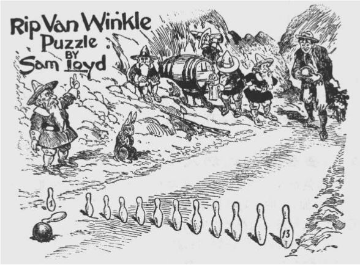

## 一些废话

[《萨姆·劳埃德的数学趣题续编》](http://book.douban.com/subject/1079701/)（[美] 马丁·加德纳）这本书大概是十多年前，我还是噼咔噼咔的高中生时读的一本书，也算是我的数学启蒙读物。里面有一道这样的题：

{margin="0 auto"}

> 古代丹麦有一种滚球游戏，据说现代的保龄球就是从它演变而来的。这种游戏玩的时候，将 13 根木柱在地上站成一行，然后用一只球猛击其中一根木柱或相邻的两根木柱。由于击球着距离木柱极近，玩这种游戏无需什么特殊的技巧，即可随心所欲的击倒任一木柱或相邻的两根木柱。比赛者轮流击球，谁击倒最后一根木柱，谁就是赢家。
>
> 同瑞普·凡·温克尔进行比赛的是一位身体矮小的山神，他刚刚击倒了第 2 号木柱。瑞普应该在 22 种可能性中最初抉择：要么击倒 12 根木柱中的一根，要么把球向 10 个空当中的任一个投去，以使一次同时击倒两根相邻的木柱。为了赢得这一局，瑞普应该怎么做才好？假定比赛双方都能随便击倒其中一根或相邻的一对木柱，而且双方都是足智多谋的游戏老手。

这道题不是重点，于是我也不卖关子直接给出原书上的答案：

> 为了保持在“昏睡山谷”（Sleepy Hollow）中的冠军地位，瑞普应该击倒第 6 号木柱。这样一来，木柱就被分为 1 根、3 根、7 根三组。接下去，无论瑞普的对手施展什么伎俩，只要瑞普采用正确的测略，对手一定要输。矮山神想要取胜，他开始时应该击倒第 7 号木柱，以便将木柱分成各有 6 根木柱的两组。此后，无论瑞普投掷哪一个组里的木柱，山神只要在另一组里重演瑞普的动作，直到最终取得胜利为止。

当然，原书里说的这种游戏的历史应该是瞎扯的。关于这个游戏的结论也很明确了：先手必胜，但是如果先手脑抽弄错了（例如，像题里说的，先击倒了 2 号），那么后手即为必胜。

## 起因

后来我滚去读大学，那也是很多年以前的了。我问了室友这道题：

> 12 个硬币依次相邻，两个人轮流取走硬币；每人每个回合可以取走任意 1 枚，或者相邻的 2 枚硬币；取走最后一枚硬币的人为**负**。先手或者后手应该怎么玩？

当然，考虑到 13 这个数字不是很吉利而改成 12，以及把胜利条件反转的主意应该不是我的，应该是我在另外某本书里看到的，但是现在的我实在记不清了。

当时的我和室友的课程刚到“C 程序基础”，于是室友沉思片刻之后，说：“这个迭代一下就能出来。”然后它打开 Turbo C 给我写了个 AI——黑乎乎的 CMD 窗口，AI 还会很贱的在你走到死路的时候告诉你：

> You are a dead man.

年代久远，关于这件事的很多细节的记忆已经很模糊。不过我还记得当时的我完全没有看懂室友的那么几十行代码。甚至也没有看出来上面的话很有可能是《北斗神拳》的梗。挣扎了很久之后室友无奈的说：“看别人的代码确实挺费劲。”我则感到无地自容。

不知为何，前几天我又突然想起来这件事情，于是打算再考虑一下这个问题——**取 12 个硬币的小游戏，先手或者后手是否有必胜的策略呢？**

## 结果

前面的废话已经很多，关于结果也就不再啰嗦：这个问题其实很简单，只要你想清楚了这件事——如果你的对手足够聪明，当轮到你取走硬币时，看到棋局你就能知道：

- 0: 无论你怎么走，你的对手都有必胜的策略（即你输定了）
- 1: 你有必胜的策略（即你赢定了）

而不存在其它的情况，即：

- 2: 胜负尚待以后的回合才能见分晓

也就是说每个棋局的状态，都具是上述类型之一，分别编号为 0、1、2。为了证明不存在类型 2，我们先假定存在它。

首先将棋局的状态用数组 $s = [a_1, a_2, a_3, ... , a_{12}]$ 表示。

$$a_i=0,1; i=1, 2, 3, ... , 12$$

$a_i$ 等于 0 表示对应位置的硬币已经被取走，等于 1 表示未被取走。在游戏刚开始时，$s_{start}=[1,1,1,1,1,1,1,1,1,1,1,1]$，结束时 $s_{end}=[0,0,0,0,0,0,0,0,0,0,0,0]$。显然存在一个函数 $f$，对于任意的棋局状态$s$，$f(s)$ 等于 $s$ 的类型。即函数 $f$ 能够求出棋局状态的类型：

$$f(s)=0,1,2$$

0,1,2 的含义已经解释过了。对于任意非全零的棋局状态 $s$，都存在一个合法的下个棋局状态的集合。设函数 $g$ 能够求出它：

$$g(s)=\{s'_1, s'_2, ..., s'_n\}$$

如果 $s'_1, s'_2, ..., s'_n$ 中存在一个或多个元素满足 $f(s'_k)=0$，那么 $f(s)=1$（即，你采用某种取法，你的对手是必输的，自然你是必胜的）；如果 $s'_1, s'_2, ...s'_n$ 中的元素都满足 $f(s'_k)=1$，那么 $f(s)=0$（即无论你采用任何一种取法，你的对手都是必胜的，自然你是必输的）；而其它的情况，$f(s)=2$。

假设存在 $s_0$，使得 $f(s_0)=2$，并且 $g(s_0)=\{s'_1, s'_2, ..., s'_n\}$。显然，$s'_1, s'_2, ...s'_n$ 中不可能存在 $s'_k$ 使得 $f(s'_k)=0$。同样的，$s'_1, s'_2, ..., s'_n$ 不可能都满足 $f(s'_k)=1$。这样，$s'_1, s'_2, ..., s'_n$ 中必然存在 $s'_k$，满足 $f(s'_k)=2$。

上面得出的结论的意思是，如果某个棋局状态的类型是 2，那么它的某个合法的下一个状态也肯定是类型 2——也就是说，游戏双方采用某种取硬币的方法，永远都不会分出胜负——这显然是违背常理的，这个游戏只有有限的状态，有限的步数，一定会分出胜负。

借助于计算机程序，我们只需实现函数 $f, g$，就能迭代出 $f(s_{start})$。$f$ 大概长这样：

```javascript
function f(s) {
    if (s == [0,0,0,0,0,0,0,0,0,0,0,0])
        return 1;
    // 并不奇怪，你的对手已经被逼取走了最后一个硬币，你已经赢了！

    for (next_s in g(s)) {
        if (f(next_s) == 0)
            return 1;
    }

    return 0;
}
```

那么 $f([1,1,1,1,1,1,1,1,1,1,1,1])$ 的值是多少呢？在实际编程之前，还需要注意到我们可以用另一种方式表示棋局的类型，即 12 个硬币分成几组，每组几个。例如$s = [12]$表示游戏刚开始的状态，$s=[2,9]$ 表示有人取走了 1 枚硬币（不用具体在意是哪枚）而把剩下的 11 个硬币分成了两组，一组有 2 个相邻，一组有 9 个相邻。

我试着实现了这个程序，你可以在这个页面按 **F12** 打开浏览器的开发者工具，找到 js console 试试：

```javascript
f([12])
```

好吧，室友在多年前虐我的问题终于算是想明白了。

## 最后

感谢 [+PZ Read](https://plus.google.com/u/0/107552441700509994147) 在[我 G+ 帖子](https://plus.google.com/u/0/+MichiruMorishita/posts/2yymPYDHMNG)里的指点，这个游戏有个名字叫做 [Kayles Game](https://en.wikipedia.org/wiki/Kayles)，是[组合博弈](https://en.wikipedia.org/wiki/Combinatorial_game_theory)中相当简单的一种，有成熟的理论指导。Wikipedia 上有很多相关的内容，不再赘述。

<script src="12-coins-game.js"></script>
