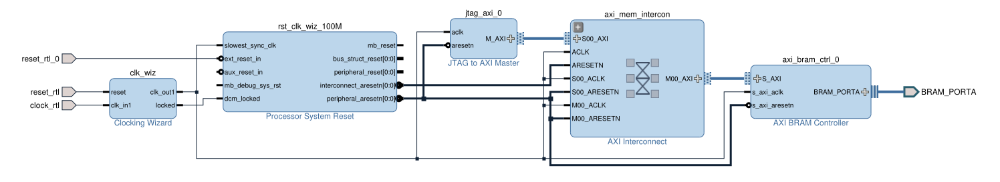
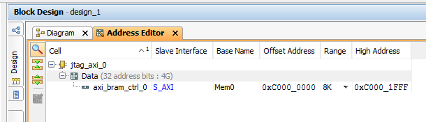
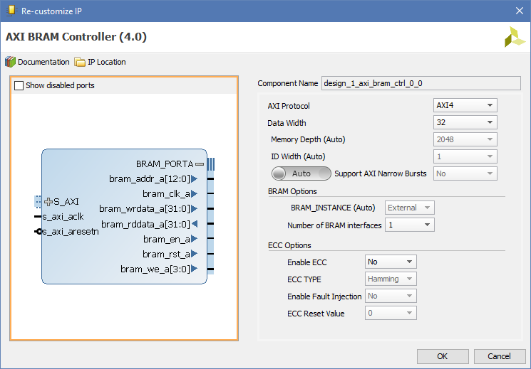

尽管在做 FPGA 产品设计时，仿真是非常重要的步骤，但是仿真确实无法做到所有的事情。有一半是因为仿真的速度实在堪忧，另一半是因为并不是所有的外设都有仿真模型。因此，上硬件调试很多时候也是不可避免的事情。为了观察片内的信号，Xilinx 为其产品提供的工具是 [Integrated Logic Analyzer (ILA)](https://www.xilinx.com/products/intellectual-property/ila.html) 和 [Virtual Input/Output (VIO)](https://www.xilinx.com/products/intellectual-property/vio.html)。大部分时候，这两个 IP 简直如同神器，直到……某个情况下你想看看某个 BRAM 里装的东西是什么。

除了尽量避免这种破事发生，其它解决手段也很多，有一个方法是使用 Xilinx 提供的另外两个 IP：[AXI Block RAM (BRAM) Controller](https://www.xilinx.com/products/intellectual-property/axi_bram_if_ctlr.html) 和 [JTAG to AXI Master](https://www.xilinx.com/products/intellectual-property/jtag_to_axi_master.html)。简单来说，JTAG to AXI Master 可以让你在 PC 上，通过 JTAG 操作一个 AXI 主设备，做 AXI 总线的读写操作；而 AXI BRAM Controller 则如字面一样，是一个 AXI 从接口的 BRAM 控制器，它把 AXI 总线地址映射为 BRAM 地址。

因此，如果你的设计中 BRAM 是单口使用的，那么可以把第二个口拉出来接在 AXI BRAM Controller 上，万事大吉。至于这两个 IP 核的连接方式，可以参考下面的图：



这里最右侧的 BRAM_PORTA 正是用来连接需要调试的 BRAM 的。在不需要地址分配和交叉连接多设备时，仍然使用了 AXI Interconnect 纯属无奈，因为在 Vivado 的 Block Design 里这样才能为 AXI BRAM Controller 分配地址大小，从而间接的为 AXI BRAM Controller 设定 Memory Depth 这个属性。



这里有个非常纠结的地方，我们看到在地址编辑器里，设定地址范围大小是 8k。这对应地址范围 0xC000\_0000 ~ 0xC000\_1FFF，即 13 位地址线。



但是在 AXI BRAM Controller 的属性里，Memory Depth 自动算出来是 2048，即 2k。这是因为对于 ARM 等 CPU，传统是按照字节（byte）来计算大小，但是数据又设定为 32 位（4 字节）宽，这 4 倍的差异就出来了。到这里似乎思路还算清晰，但是又看到 AXI BRAM Controller 的 BRAM\_PORTA 接口的地址位仍然是 13 位。实际上 32 位宽，2048 深度的 BRAM 的地址线是老老实实的 11 位，和这 13 位地址线连接时只能连到高 11 位。换句话说低两位地址似乎并没有什么用……

稍复杂一点的事情是，JTAG to AXI Master 没有提供一个 GUI 界面来操作，你必须使用 tcl 命令来作控制操作，为此还得读一读 IP 的帮助文档。这里不再赘述。

另外在使用 AXI BRAM Controller 读写大量数据时，一次性写操作最多的（256 个）数据会比一个一个读写快很多。下面是一个简单的例子，它从某个文件里读取数据，然后写入到 BRAM 里：

```tcl
set file [open "input.txt"]
set addr 3221225472
# 3221225472 = 0xC000_0000

for {set i 0} {$i < 8} {incr i} {

    # Build data
    set data ""
    for {set j 0} {$j < 256} { incr j} {
        get %file line
        set data $line$data
    }

    # Create axi trans and run it
    create_hw_axi_txn -address [format %08x $addr] -data $data -len 256 -type WRITE -force wr_txn hw_axi_1
    run_hw_axi wr_txn

    # Address increment
    incr addr 1024
}

delete_hw_axi_txn wr_txn
close $file
```

注意到 `-len 256`，我们每次写入 256 个数，这样写入 8k 的数据耗时不过几秒。如果是 `-len 1` 则要几分钟，效果明显。
