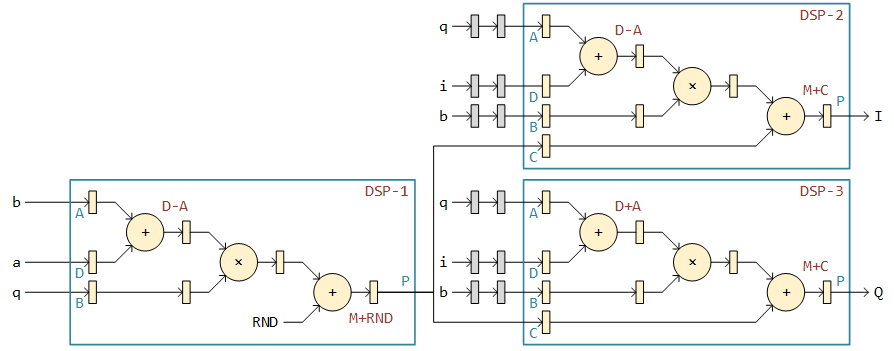

复数乘法是一个常见的运算，尽管 Vivado/SysGen 中自带复数乘法的器的 IP，但仍然让我们来看看如何从头设计一个——这有助于我们更加了解 Xilinx FPGA 并且锻炼自己的设计能力……好吧我不吹了，有 IP 谁想自己写。但是最近我的 SysGen 工程仿真时只要有 Xilinx 的复乘 IP 就报错，明明稍早些的时候还是好好的。

Debug 了半天一无所获，只能重新造个轮子了。

复数乘法可以写成：

```plain
I + Qj = (a + bj) * (i + qj)
       = (a * i - b * q) + (a * q + b * i)j
       = [(a - b) * q + a * (i - q)] + [(a - b) * q + b * (i + q)]j
```

其中 `I,Q,a,b,i,q` 都是实数，`j` 是虚数单位。因为 `(a - b) * q` 的结果可以重复使用，因此这样计算复乘仅需要 3 次乘法。这也被称为 3 乘法器复乘结构。不卖关子，我们直接给出一个 Xilinx FPGA 中的 pipeline 的实现方案：



从左侧开始，数据向右向上流动。DSP-1 计算出 `(a - b) * q`，然后将结果传给 DSP-2 和 DSP-3。 DSP-2 最终完成 `I` 的计算，DSP-3 完成 `Q` 的计算。注意 DSP48 的第一级加法器也可以做减法（D-A 模式），无需额外的资源来做负号运算。RND 是一个常数，用作输出的修约。如果输出使用全位宽，那么 RND 为 0。

这个设计的优点在于尽量使用了 DSP48 中的预加器和 ALU 加法器，实际上 3 个 DSP48 中的 6 个加法器已经都用上了，这样模块能有最大的工作频率和吞吐量，以及最小的资源消耗。例如一个 16 位乘 16 位的复乘，中间量有 31 位。而 31 位加法器（31 + 31 = 32）用 FPGA 的逻辑资源实现的话，资源占用和逻辑级数会非常高。哪怕是 16 位加法器（16 + 16 = 17），在 UltraScale 器件中的逻辑级数一般也会是 4，在 7 系列器件中一般会是 6。如果想要跑比较高的时钟频率（>350 MHz) 也比较危险的。当然，DSP48 的功耗自然也不会小。

整个模块的延迟是 6 个时钟，有些延迟匹配使用了逻辑资源中的寄存器（`i,q` 的延迟匹配寄存器可以合并）。这个设计中最关键的路径是 DSP-1 的 P 口 到 DSP-2/3 的 C 口，其间没有经过寄存。因此工具必须将 DSP48 布得尽量近。但一般来说除非整个工程资源占用非常高，这个要求肯定是可以满足的。时序紧张时，可以考虑在其中加一级寄存。

一些杂项：

1. HDL 设计时可以用采用描述的行为模型，让工具来自动推断。一般来说 Vivado 工具可以自动把加减法塞到预加器和 ALU 的里去，因此复乘模块可以不使用 DSP48Ex 的原语库，增加可移植性；
2. Vivado 的模板库里有复乘的模板，可以直接拿来用；
3. 在 SysGen 中，工具只会自动将加法放进预加器和 ALU，对于减法坚持用 LUT，因此在 SysGen 中只能用 DSP48Ex Block 来实现；
