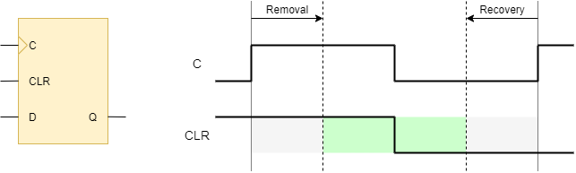

We usually discuss synchronous vs asynchronous reset. Readers need to beware that "asynchronous reset" may refer to: 

1. The register has an async reset pin instead of sync reset pin.
2. The reset signal arrives asynchronously with your clock.
3. Your design strategies about reset.

Let's talk them one by one.

## Register with Asynchronous Reset

First, let's look at the verilog code:

```verilog
  always @ (posedge clk or posedge arst) begin
    if (arst) begin
      data <= 1'b0;
    end else if (cen) begin
      data <= din;
    end
  end
```

The code holds nothing special. `data` will be reset to `1'b0` when `arst` asserted, and back to normal operation if `arst` de-asserted. Since reset have higher priority over clock, the `Q` output will be cleared even without the edge of clock. After synthesis, you will surely get a Flip-Flop register with async reset.

The time async reset asserted is usually not import, since the output of register will be guaranteed after reset. However, if async reset is released on the time near the clock edge, the register may enter a metastability state. Metastability means unpredictable output, and possibility of fail. So, **even async reset have timing requirement similar with sync reset**. This is a common misunderstanding for new designers. The required timing relationship is called **recovery and removal time** check.



**Recovery check** ensures reset signal goes stable at least "recovery time" before the active clock edge. Like "setup time" for sync pin, right? **Removal check** ensures reset signal should only change at least "removal time" after the active clock edge. Similar with "hold time". Note that the "recovery and removal time" only defined for the de-assertion of sync reset. Since assertion of async reset will take charge of the output, regardless the clock edge.

## The Reset Signal Arrives Asynchronously

The natural behavior of async reset pin self brings no problem, as long as it meets the recovery and removal time requirement. The real problem is the violation of timing requirement. For example, if the reset signal comes from an external pin, nothing could ensure when it arrives. Other example including use locking indicator of PLL as async reset. Reset comes from other time domains should also be considered as async. We already know that even async reset signal need to satisfy the recovery and removal time, or it may cause the design fail.

To avoid the problem of async reset signal, we usually have an "asynchronous reset synchronizer" circuit. Here we give two most used:

### 1. Asynchronous Reset, Synchronous Release


Several registers are chained together. Those registers have async reset pin connected to external reset input. When `src_arst` asserted, all registers and `dest_arst` goes to 1 immediately. After `src_arst` de-assert, it takes several clock ticks before `dest_arst` goes back to 0. To clean up the metastability cased by the unknown arrive time of async reset, the chain need at lease 2 FFs. More taps of pipeline helps to reduce the mean time between failures (MTBF).

### 2. Full Synchronizer


A simple general purpose single-bit CDC circuit may satisfy our requirement. `dest_rst` will assert and de-assert synchronously with `dest_clk`. The synced reset could safely go to async or sync reset pin of registers. Comparing with 1, it will not work without the presence of clock.

## Synchronous vs Asynchronous Reset

If you can decide the reset type to use for your registers, don't worry too much. Each can effectively implement the design and archive the purpose of reset. Each has its own advantages and disadvantages. If you need to reset a specification region of logic before a clock starts up (or even with no clock), sync reset can't help. If reset signal also arrives asynchronously, synchronizer type 1 remains the only option. 

ASIC designers usually choose async reset. It saves the amount of transistors. While Xilinx recommends sync reset for their FPGA device. This may because they already implemented sync reset for most of their primitives. Tools can optimize the design deeper using the interchangeability of sync reset. 

Here give the brief summarize of reset type and synchronizes choose:

|             | Gated Clock     | No Gated Clock  |
|-------------|-----------------|-----------------|
| Async Reset | Synchronizer #1 | Both            |
| Sync Reset  | Not possible    | Synchronizer #2 |

Detailed reset strategies will be talked in another post.
