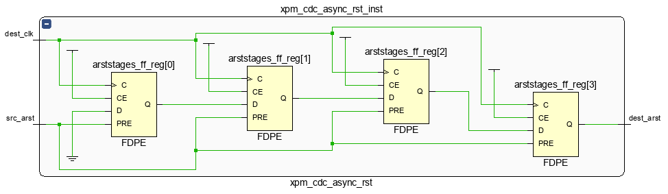
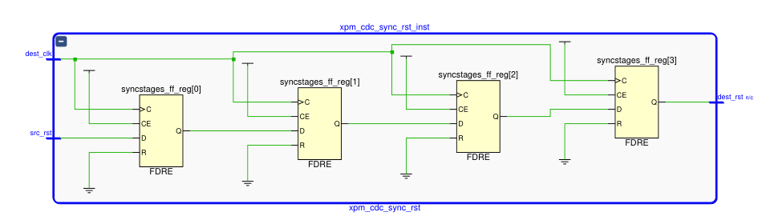

## The Problem of Asynchronous Reset

If you have looked at Xilinx primitive library, there are 4 types of D Flip-Flops (FF). The differences between them depends on whether they have a synchronous/asynchronous or clear/preset pin. When writing HDL code, we can model an FF with async clear:

```verilog
  always @ (posedge clk or posedge arst) begin
    if (arst) begin
      data <= 1'b0;
    end else if (cen) begin
      data <= din;
    end
  end
```

Then you will get a FDCE after synthesis. The code is nothing special. Register `data` will be set (reset) to `1'b0` when `arst` is asserted, and back to normal operation if `arst` is de-asserted. Since reset have higher priority over clock, the `Q` output will be cleared even there is no clock.

But async reset is more complicated than expected. With a long reset period, we can ensure all registers are under reset. However, if async reset is released on the time near the clock edge, the register may enter a metastability state. The output will be unpredictable and may cause the design fail. So, even async reset have timing requirement similar with sync reset. This is a common misunderstanding for new designers.

The required known relationship between the clock and the async reset signal are called **recovery and removal time** checks. These checks are defined only for de-assertion of asynchronous reset.

To avoid the problem of async reset, we can divide the situation into two case:

## Asynchronous Reset is Need

For example, if you need to reset a specification region of logic before clock is ready (or even no clock), async reset is the only option. Some ASIC library may even only provide async reset Flip-Flops. In these cases, we usually use a asynchronous reset synchronizer ("asynchronous reset but synchronous release").



When `src_arst` is assert, all registers and `dest_arst` are set to 1 immediately. After `src_arst` is de-assert. It takes serval clock tick for `dest_arst` to go back to 0. The register chain help cleanup the metastability cased by the unknown arrive time of async reset. At lease 2 FFs are need, more stages of pipeline improves.

Using clock gating would also help. After disable the clock and assert asynchronous reset, all registers are under reset, release reset, then feed clock again. Consider the possible unstable clock for first cycles, usually we still need this synchronizer.

## Asynchronous Reset Could Be Replaced

In most case, we can replace async reset with sync reset. In this case, a simple general single-bit CDC circuit will satisfy our requirement:



`dest_rst` will be asserted and de-asserted synchronously with `dest_clk`.
