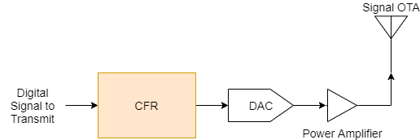
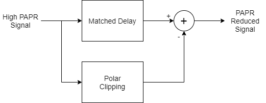
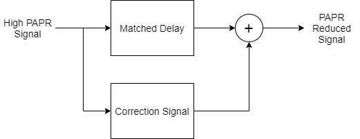
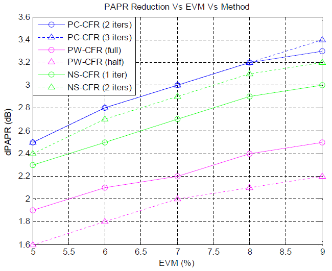

# Crest Factor Reduction I

CFR is a technique used to reduce the PAPR of the transmitted signals. This a key module in LTE/NR radio. In this serious of post, let's see how a CFR is implemented in digital circuits.

## CFR Concept

In LTE/NR telecommunications, [OFDM](https://en.wikipedia.org/wiki/Orthogonal_frequency-division_multiplexing) is used as the method to encoding digital data to RF waveform. One of the disadvantage if OFDM is high (Peak to Average Power Ratio) PAPR. Crest Factor Reduction (CFR) is a technique used to reduce PAPR of transmitted signal so that power amplifier (PA) can operate more efficiently.

To know the necessary and consideration of CFR, we need to know the typical characteristic of an RF (PA).

### RF Power Amplifier

For an ideal PA, the input and output has a linear relationship: that is, if input power of PA increased 1 dB, output power of PA will also increase by 1 dB. But ability of PA is not infinity. As the input power level increase, there will be a power level that the output of PA won't increase that much with input. That is, the output power starts to saturate. Eventually, the slope of the input vs output power becomes zero. The power level at which this happen is known as *saturate point*. The **output power** of saturate point is $P_{saturation}$.

To use this PA to amplify RF signal, usually we will have some back off from saturation power (for example, 1 dB, which is called $P_{1dB}$. Below the back off level is the operation range. If more linearity is wanted, we can back off more, if you need more output power, you need back off less. Peak power of output is $P_{peak}$. Average output power $P_{average}$ can be calculated by:

$$P_{average} = P_{saturation} - P_{backoff} - {PAPR}$$

You can see that PAPR of signal affects average power of PA output. Signal with smaller PAPR can be amplified to higher power. If the output power is a fixed requirement, you can operate PA with lower saturation level (less supply voltage). In fact, efficiency of PA is a complex thing, but we can have a quick evaluation that operating at nonlinear range will be more efficient than operating at linear range. So at both case, it will be better efficient during transmit.

### Functionality of CFR

We know that PAPR has impact on PA's efficiency. So CFR is introduced to reduce the PAPR of signal. But how? The easiest way to reduce PAPR of signal is to clip the *peak* of the signal. We will have a threshold, which is target PAPR we want. If we see the signal's instance power is larger than threshold, we clip the excess part. Result a PAPR reduced signal, but causes error comparing to the original signal. That's the cost of CFR. Also we need to know that for RF equipment, the Adjacent Channel Leakage Ratio (ACLR) is a key requirement. This requires your signal should be "smooth" enough so that you will not interfere your neighborhood. This is another consideration CFR should take.

### Placed in System

Usually, CFR module is placed at the position before DAC to alter the signal to transmit:

## CFR Methods

In practice, there are different CFR algorithms, such as:

- Hard Clipping
- Peak Cancellation
- Peak Windowing
- Noise Shaping

I will have a brief introduction based on the complexity of each method:

### Hard Clipping

*Hard Clipping* is very simple, it's the way I mentioned in [Functionality of CFR](#functionality-of-cfr). The clipping mathematical equation is as follows:

$$
x_{clipped}[n] = c[n] \cdot x[n]

c[n] = \begin{cases}
\frac{A}{|x[n]|} & |x[n]| \ge A\\
1 & |x[n]| < A
\end{cases}
$$

where $A$ is the clipping threshold. However, in digital circuits, division and multiplication is expensive. The clipping is usually archived by a subtraction. The structure is as follows:

The *Polar Clipping* block will extract the part exceeds threshold and it will be subtracted from original signal with matched delay. The purpose of the delay is to compensate for all the latencies generated during the detection and extraction of the clip sequence. The main problem of this algorithm is the clipping cause some sharp corner during the point where signal go through the threshold. The sharp corner will cause some out-of-band noise and impact adjacent channel.

We will not go much detail here since we will introduce the implementation in next post.

### Noise Shaping

The **Noise Shaping** (NS) algorithm, sometimes referred to as **Peak Filtering** (PF), consists of extracting the part of the input signal whose magnitude exceeds the threshold, then filtering it and finally subtracting it from a properly delayed version of the original signal itself. Compared with hard clipping, the difference is the noise shaping filter. The filter should have a better shape on adjacent channel, so the filter is designed based on the specified type of signal.

The problem of NS CFR is that after the filtering operation it self, it is possible that some peaks will be created again (the so called **peak regrowth** phenomenon). So cascading several stages of NS maybe necessary.

### Peak Windowing

The **Peaking Windowing** (PW) algorithm is based on multiplying the signal with an attenuation window rather than adding a correction to the signal. When a peak is detected in the input signal, a set of coefficients is loaded and scaled to ensure that the peaks will be attenuated to the desired level (threshold). The coefficients (the window) is multiplied to the peak using a FIR.

The advantage of the algorithm is that the window amplitude changes smoothly, then not much out-of-band emission is expected to appear. But on the other hand, the windowing method lack the knowledge about the exact frequency characteristics. This make it harder to guarantee a required specified OOB performance.

### Peak Cancellation

The algorithm of Peak Cancellation (PC-CFR) is simple. When a peak is detected in the input signal, it does not filter the clip error sequence. PC-CFR only isolates a single input element sample among those identified as peaks. It cancels them individually by subtracting properly shaped cancelling pulses from the signal, one for each peak. The pules are designed to have the same spectrum as the signal.

It aims to strike a balance between the out-of-band emission and in-band waveform quality when compressing the signal to a target PAPR.

## Comparing of Methods

The system-level performance of Peak Cancellation (PC-CFR) is shown to be better than other methods with save overall cost. This is the compare result of different CFR Method from Xilinx:

In next post of this series, I'll introduce more detailed implementation of a real CFR module.
