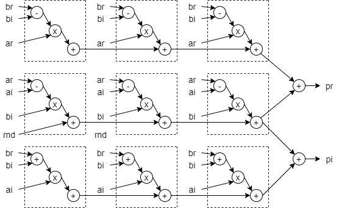

复数乘法是一个常见的运算，尽管 Vivado/SysGen 中自带复数乘法的器的 IP，但很多时候并不是那么好用。让我们看看怎么重新造一个轮子：

## 复数乘法

复数乘法可以写成：

$$
\begin{aligned} pr + pi \cdot j &= (ar + ai \cdot j) \times (br + bi \cdot j) \\ &= ar \times (br - bi) + (ar - ai) \times bi + (ai \times (br + bi) + (ar - ai) \times bi) \cdot j
\end{aligned}
$$

其中 $ar$，$ai$，$br$，$bi$ 都是实数，$j$ 是虚数单位。因为 $(ar - ai) \times bi$ 的结果可以重复使用，因此这样计算复乘仅需要 3 次乘法。这也被称为 3 乘法器复乘结构。我们直接给出一个 Xilinx FPGA 中 pipeline 的实现方案：

从左侧开始，DSP-1 计算出 $(ar - ai) \times bi$，然后将结果传给 DSP-2 和 DSP-3。 DSP-2 最终完成 $pr$ 的计算，DSP-3 完成 $pi$ 的计算。注意 DSP48 的第一级加法器也可以做减法（D-A 模式），无需额外的资源来做负号运算。$rnd$ 是一个常数，用作输出的修约。如果输出使用全位宽，那么 $rnd$ 为 0。

这个设计的优点在于尽量使用了 DSP48 中的预加器和 ALU 加法器，实际上 3 个 DSP48 中的 6 个加法器已经都用上了，这样模块能有最大的工作频率和吞吐量，以及最小的资源消耗。Fabric 部分仅需要寄存器做延迟对齐。Fabric 以及 DSP 中的寄存器配置没有画出，可以根据实际工作的时钟频率及关键路径（在这个设计里是 DSP-1 的 P 口 到 DSP-2/3 的 C 口）在需要的位置插入寄存器。（Tips：$br$，$bi$ 的延迟匹配寄存器可以合并）。

## 复数乘加链

和实数乘法器类似，复数乘法器可以组成乘加链来实现复数 FIR（或者叫均衡器/Equalizer）。我们可以有一个类似的实现：

这个设计里由于第一级 ALU 加法器没有使用，因此需要在 Fabric 上实现一个加法。同样的，这里没有给出延迟寄存器的配置。关于此我们可以在另外一篇文章里讨论。
