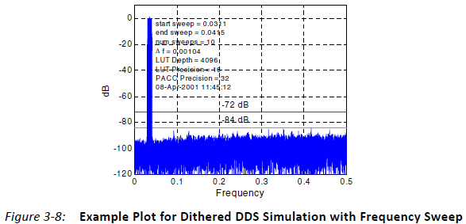
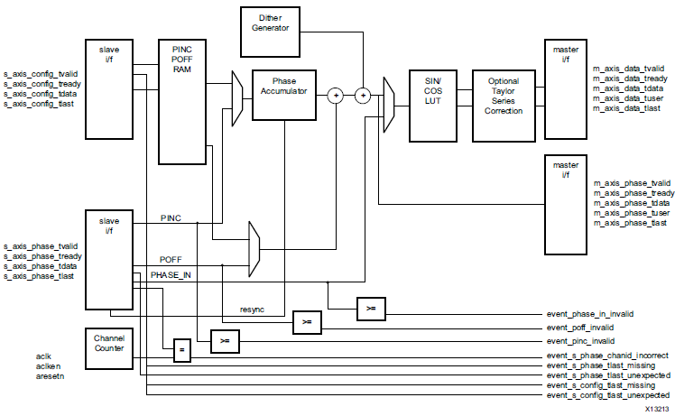
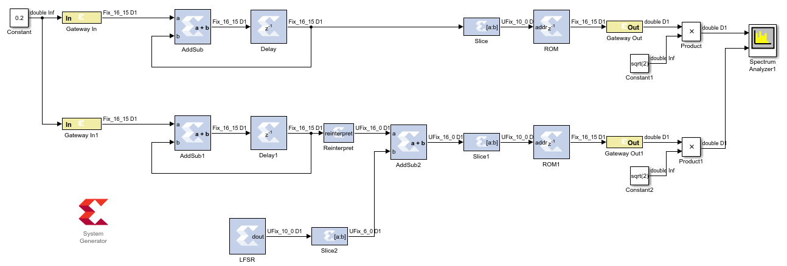

DDS（Direct Digital Synthesizer，直接频率合成器），或者叫 NCO（Numerically Controlled Oscillator，数控振荡器）是数字信号处理中的一个非常重要的组件。一般来说，DDS 利用查找表法产生一个数字的正弦曲线。其它的算法包括 CORDIC、泰勒展开等。典型的应用包括 DUC/DDC。

## 基础

简单来说，DDS 完成这样的运算：

$$y = \sin({\Theta(n)})$$

其中 $y$ 是 DDS 模块的输出；$n$ 为整数，是现在时刻的编号；$\Theta(n)$ 是期望输出曲线的相位。

由于在 FPGA 中，$\Theta(n)$ 和 $y$ 都需要量化，而且一般采用定点实现。这就引出了 DDS 中的两个硬件参数：

- 相位位宽（Phase Width）：$B_{\Theta(n)}$
- 输出位宽（Output Width）：$B_y$

一般来说有 $B_y \geq B_{\Theta(n)}$，因为如果输出位宽比相位位宽还小的话，很多不同的相位会算出相同的结果，也就是计算中有大量的浪费。

考虑量化之后的 DDS 公式要写成：

$$y = \sin(2\pi\frac{\Theta(n)}{N})$$

其中 $N = 2^{B_{\Theta(n)}}$。这两个硬件参数会影响 DDS 的两个主要性能指标：

- 频率精度（Frequency Resolution）：$\Delta{f}$
- 无杂散动态范围（Spurious Free Dynamic Range）：SFDR

频率精度指 DDS 输出频率能够调整的最小步进，由相位位宽决定:

$$\Delta{f} = \frac{f_s}{N}$$

其中 $f_s$ 是 DDS 对正弦曲线的采样率。例如 $f_s = 100 MHz$、$B_{\Theta(n)} = 10 bits$ 时有：

$$\Delta{f} \approx 100 kHz$$

SFDR 反映输出信号的频谱纯度，由输出位宽决定，Xilinx 给出了一个近似的计算公式：

$$SFDR = 6 \times B_y [dB]$$

$B_y = 16 bits$ 时，有 $SFDR = 96 dB$。可以看到在上述配置下，SFDR 参数已经很不错了，但是频率精度却有些低。增加频率精度的方法是提高相位位宽，但是这会增加 $sin()$ 函数计算时的复杂度。特别是采用查找表算法时，查找表体积随相位位宽指数增长。

一个折中的方法是相位位宽较高，但是真正计算正弦曲线时，仍然采用较低的位宽来计算，即截位后计算。这种方法提高到了频率精度，但是又带来了新的问题——计算时对相位量进行了截位，从而出现了相位误差。相位误差会造成输出波形的失真，表现为杂散（spur）。

如上图所示，DDS 输出频率设定为 $0.1f_s$。红色为相位宽度和计算位宽一致（10 bits）时 DDS 的输出。蓝色为相位宽度为 16 bits、计算位宽为 10 bits 时 DDS 的输出。可以看到红色曲线的 SFDR 优于 100 dB，而蓝色为 60 dB。

需要说明的是，杂散是由于相位累加和计算位宽的不一致，即相位误差误差造成的。采用一致的累加位宽和计算位宽就能够避免这个问题。即便采用不一样的位宽，对于那些刚好“凑整”的输出频率，例如 $f_s/4$、$f_s/8$，也不会产生这个问题。即杂散的情况和输出频率有关。

Xilinx 给出了位宽不一致情况下 SFDR 的估算公式：

$$SFDR = 6 \times B_{\Theta(n)}$$

其中 $B_{\Theta(n)}$ 是用于计算的相位位宽。这时能看到一个有趣的结果：SFDR 同样是由相位位宽决定的，而输出位宽只要满足 $B_y \geq B_{\Theta(n)}$ 就足够了，再多也不是很有用。

## 改进的算法

我们希望在频率精度足够的同时改进 SFDR。常用的方法包括两个：相位抖动和插值。

### 相位抖动

相位抖动本质和 [FPGA 中的修约](http://blog.michiru.me/posts/rounding-in-fpga.html)类似：将原本被我们截位掉的低位（看成小数点后的部分）修约到高位。而修约又不能采用四舍五入等固定的方法，因为固定的修约方法仍然会造成杂散。在上文的最后我们提到了随机修约，这正是我们想要的，但又有不同：

随机修约只针对小数部分为 0.5 的情况，其它小数值仍然遵守四舍五入。我们希望所有的小数部分都能随机的修约，当然，“舍”还是“入”的概率也应该由具体的小数值来决定。例如 0.5 有 50% 的几率舍去、有 50% 概率舍入；而 0.1 有 90% 的概率舍去，而只有 10% 的概率舍入。

具体的可以这样计算：在相位值截位之前，为其加上一个小的随机量（白噪声）。随着这个随机量期望的增大，DDS 输出信号频谱的底噪会被抬高，但是杂散却会降低。这是因为由于随机的舍去舍入，杂散的能量“平均”了。如果控制得当，杂散可以刚好压制到和低噪一样高，就能得到最好的 SFDR 性能。

同样的，我们直接说结论，Xilinx 告诉我们相位抖动带来的好处大概是 12 dB，约等于 2 位相位位宽。如果是查找表实现的 DDS，在同样的 SFDR 性能下，相比没有相位抖动处理的 DDS，可以节约 3/4 的查找表体积。上图是 Xilinx 的仿真结果，采用了 12 bits 相位位宽。没有相位抖动时理论 SFDR 是红线（-72 dB），而有了相位抖动之后能够达到绿线（-84 dB）。注意到 Xilinx 采用了多个输出频率来测试，这时因为杂散是和输出频率相关的。

数字音乐播放器中也常用抖动来对音乐进行处理，特别是需要对音乐进行重采样，以及需要截位输出的时候。

### 插值

插值的思路也很简单，利用小数部分和“周边”的几个采样点来计算出一个更近似的输出值。例如最简单的线性插值利用附近两个采样点，将小数部分作为权值来进行插值。更复杂的插值方法包括 sinc 插值等。

显然，插值需要更多额外的资源来进行计算，对于查找表实现的 DDS，后续插值是在 SFDR 要求特别高（例如 100 dB 以上）时唯一的选择。似乎 SFDR 要求不高时插值也可以用来缩小查找表体积，但其实 FPGA 中 DSP 和 BRAM 是差不多一样重要的资源，这样做不是特别值得。

## 实现

Xilinx 的 [DDS IP][PG141] 设计非常典型，我们以此为例：它包括 **Phase Generator** 与 **Phase to Sinusoid** 电路。**Phase Generator** 中又包括 **Phase Accmulator** 和 **Dither Generator**；**Phase to Sinusoid** 中包括 **SIN/COS LUT** 和 **Taylor Series Correction**。

由于 Xilinx DDS IP 在接口上的控制信号比较多，结构也设计的比较复杂，我们可以设计一个精简的 DDS。**Dither Generator** 和 **Taylor Series Correction** 是可选的，并且是互斥的。相位抖动 DDS 结构简单，我们考虑采用这种结构：

首先是一个精确的，例如 16 bits 的相位累加器，其相位值加上抖动产生器产生的随机数。其和进行截位后作为查找表的地址。采用 System Generator 实现的上述 DDS 如下：

需要注意的是，相位累加器的位宽为 16，相位计算（查表）时的位宽为 10，需要截位的 6 位都被加上了随机数。实际的系统中如果还需要精简，随机数的位数可以缩减到 3~4 位，但是其随机性必须要比较好。也就是说，如果采用 PRBS 作为抖动源的话，PRBS 序列的长度必须稍长。PRBS6 只有 63 bits，实验中会发现有点不够用（表现为输出信号仍然有较小的 spur），因此这里采用了 PRBS10 截取高 6 bits，效果稍好：

蓝色没有采用抖动；基佬紫为抖动之后的结果。可以看到 SFDR 大概有 71 dB，改善了 11 dB。

## 其它一些细节

利用 Xilinx FPGA 中 BRAM 有两个接口的特性，可以同时实现 Sin 和 Cos 查找表而不用多做一个冗余的表，因为：

$$cos(x) = sin(x+\frac{\pi}{2})$$

当查找表位宽为 10 bits，输出位宽为 16 bits 时，完整的正弦曲线的比特数为 16384 bits，这刚好是 Xilinx FPGA 中 BRAM 最小单元的大小（18k BRAM）。当查找表位宽为 12 bits 时，可以利用正弦曲线的对称性缩小 3/4 的查找表，但需要额外的逻辑资源来进行数学“负数”运算，以及处理零点的问题。

## 参考

- [PG141](http://www.xilinx.com/support/documentation/ip_documentation/dds_compiler/v6_0/pg141-dds-compiler.pdf)
- <http://www.ee.scu.edu/classes/2005fall/elen226/dds_2.pdf>
- <http://www.analog.com/media/cn/training-seminars/tutorials/450968421DDS_Tutorial_rev12-2-99.pdf>
