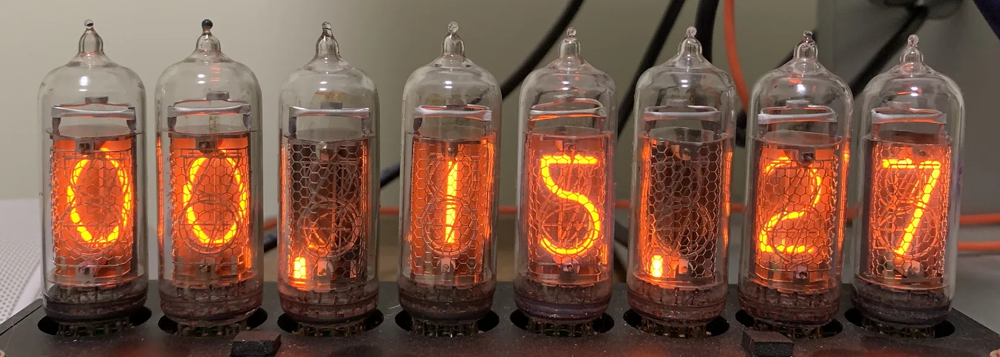

Hi, I'm Kele. Welcome to my personal blog, a place to log some of my random thought. I try to write in English but still some content in Chinese. Current topics included here are:

## FPGA Design

### General

- [Asynchronous Reset](./fpga-async-rst/fpga-async-rst.md)

- [FIFO](./fpga-fifo/fifos-in-vivado.md)

- [SystemVerilog Variable and Net](./systemverilog-variable-and-net/systemverilog-variable-and-net.md)

### Digital Signal Processing (DSP)

Generally target on Xilinx's device. However, some parts should still suit for general design (e.g., Intel device and ASIC).

- [Rounding](./fpga-dsp-rounding/rounding-in-fpga.md)

- [DDS](./fpga-dsp-dds/dds-fpga.md)

- [FIR](./fpga-dsp-fir/fir-in-fpga-1.md)

- [Complex Multiplier](./fpga-dsp-cmult/cmult-in-fpga.md)

- [Crest Factor Reduction I](./fpga-dsp-cfr/crest-factor-reduction-i.md)

### Vivado

- [Write OOC DCP](./vivado-ooc-dcp/write-ooc-dcp-in-vivado.md)

- [HSL](./vivado-hls/vivado-hls-hands-on.md)

- [SysGen](./vivado-sysgen/sysgen-hands-on.md)

## Zynq

- [ZYNQ Easy Startup Guide, Part I](./zynq-easy-startup-guide/zynq-easy-startup-guide-1.md)

- [ZYNQ Easy Startup Guide, Part II](./zynq-easy-startup-guide/zynq-easy-startup-guide-2.md)

## Misc

- [8b/10b Encoding](./8b-10b-encoding/8b-10b-encoding.md)

- [12 Coins Game](./12-coins-game/12-coins-game.md)

## About

- [About Me and This Blog](./about-me/about-me.md)
