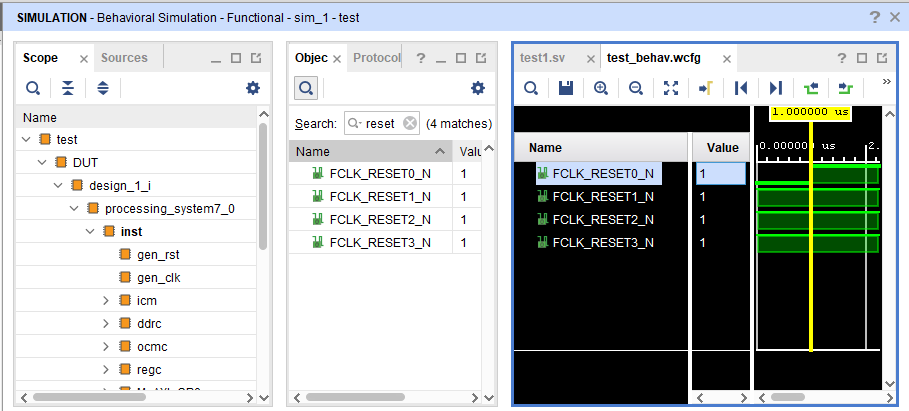

从 Vivado 2017.1 开始，Xilinx 的 Vivado 中集成了一个新的 IP，叫做 *Zynq-7000 Verification IP*（Zynq VIP）。这个 IP 主要用于 Zynq 处理器的逻辑仿真。根据 [Xilinx 的说法](https://www.xilinx.com/products/design-tools/vivado/verification-ip.html)，这个 IP
将会取代 Zynq-7000 BFM IP。Xilinx 有一个文档 [DS940](https://www.xilinx.com/support/documentation/ip_documentation/processing_system7_vip/v1_0/ds940-zynq-vip.pdf) 来解释这个 IP 怎么用，不过并不是很清晰。我们来看看怎么用它。

## 基础

### 什么是 Zynq VIP

*Zynq VIP* 是一个“Simulation Only”的 IP，用于 Zynq ARM 处理器的“基本功能”的建模和功能仿真。具体来说，我们在仿真平台里，可以使用这个 IP 来模拟 Zynq 对于内存和各个总线的读写，以便验证 Zynq ARM 处理器与其余逻辑的交互的正确性。

### 为啥要这玩意儿

通常来说在做 Zynq 开发时，一般的流程是首先由逻辑工程师搭建初版的底层平台。这包括在 Vivado 中做一个包含 Zynq 处理器的 Block Designe，并添加核心外设，然后导出为 *.hdf* 或者 *.dsa* 文件。软件工程师拿到这个文件之后利用 Xilinx 的工具生成 BSP，继续后续的开发。这里的问题在于在设计初版平台的时候，有时候处于一个“盲目”的阶段。逻辑工程师只能通过 Double Check 来保证各个参数的设置是正确的，并且期望导出的设计没有问题。软件工程师在硬件平台上验证之后向逻辑工程师反馈问题。逻辑工程师根据软件工程师的反馈来定位错误、修正错误，然后递交 Path。这个迭代稍显低效漫长。

有了 Zynq VIP，一些验证工作可以首先由验证工程师在仿真中完成，而不用等到硬件平台完成之后才能开始反馈问题。同时，逻辑工程师也可以利用仿真来定位模块的问题，特别是一些需要寄存器配置初始化才能工作的 IP。

## 开始使用 Zynq VIP

实际上，在 Vivado IP 集成器中，并没有一个专门的 IP 叫做 Zynq VIP。它就是 **ZYNQ7 Processing System**——这个 IP 集 Zynq ARM 配置与仿真于一身。例化了这个 IP，Zynq VIP 就已经在我们的设计中了。让我们来一步一步开始：

### 新建设计

首先新建一个简单的工程，包含 ZYNQ7 Processing System：

1. 新建工程 **project_1**，选择某个 Zynq 器件，例如 **xc7z020clg484-1**
2. 通常 ZYNQ7 Processing System IP 都被放在一个 Block Design 中。新建 Block Design，名为 **design_1**
3. 例化 IP ZYNQ7 Processing System，调用 Default 预设。预设中设置了 DDR、M AXI GP0 接口、FCLK_CLK0、FCLK_RESET0_N
4. 连接 `FCLK_CLK0` 和 `M_AXI_GP0_ACLK`，以便通过 DRC 检查
5. 为 **design_1** 创建一个 HDL 包装 **design_1_wrapper**

完成的设计如下：


### 新建仿真 Testbench

1. 创建 Simulation Source，文件名 **test.sv**。注意使用 SystemVerilog 的 *.sv* 格式
2. 在 **test.sv** 中例化并连接 **design_1_wrapper**，例化名 **DUT**

   ```systemverilog
   design_1_wrapper DUT (.*);
   ```

### 调用 Zynq VIP API

1. 运行 **test** 这个空仿真，以便确认 VIP 的 Hierarchy 路径。找到 **/test/DUT/design_1_i/processing_system7_0/inst**，这就是 Zynq VIP 的路径

   

2. 在 **test.sv** 中添加：

   ```systemverilog
   initial begin
       DUT.design_1_i.processing_system7_0.inst.fpga_soft_reset(1);
       #1000;
       DUT.design_1_i.processing_system7_0.inst.fpga_soft_reset(0);
   end
   ```

   注意 `fpga_soft_reset()` 函数，我们已经在调用 Zynq VIP API 了！

3. 在 Waveform 窗口中观察 **/test/DUT/design_1_i/processing_system7_0/inst/FCLK_RESET0_N** 信号，可以看到它在仿真开始时为低，在 1us 时被拉高

## Zynq VIP API 集

根据 DS940，**fpga_soft_reset** 用于产生 PS -> PL 复位，即控制 `FCLK_RESETx_N` 信号，API 参数含义与 ZYNQ 中 **FPGA_RST_CTRL** 寄存器内容相同。根据 UG585，这个寄存器的地址为 `0xF8000240`，Bit0～3 分别为 FPGAx_OUT_RST。写 0b1 为 Assert Reset (Low logic state)，写 0b0 为 De-assert Reset (High logic state)。

可惜的是，VIP 的 **fpga_soft_reset** 功能并不是通过写内部寄存器来实现的。实际上 VIP 提供的 API 主要分为：

* AXI Master 控制，用于控制 Zynq 发起 AXI Transation
* AXI Slave 控制，用于配置 Zynq 如何响应 PL 发起的 AXI Transation
* DDR/OCM 控制，用于控制 Zynq 发起内存读写
* PL -> PS 中断监控，用于等待中断
* 对于 Zynq 内部寄存器，VIP 仅提供了读 API，并且只能读出默认值。无法写入

所以，VIP 终究无法像真正的 Zynq ARM 那样通过操作内部寄存器来完成各种功能。

所有的 Zynq VIP API 可以从 DS940 中找到。此外，Xilinx 提供了一个 Zynq VIP 的实例工程，但是并不在 ZYNQ7 Processing System IP 的实例里。这个实例工程可以通过 Vivado 中的 **File > Project > Open Example... > Select Project Template > Base Zynq** 找到。

## 参考

* [Zynq VIPを利用したテストベンチ](https://www.slideshare.net/ssuser479fa3/zynq-vip-78968931)
* [Xilinx's Page about Verification IP](https://www.xilinx.com/products/design-tools/vivado/verification-ip.html)
* [DS940, Zynq-7000 SoC Verification IP Data Sheet](https://www.xilinx.com/support/documentation/ip_documentation/processing_system7_vip/v1_0/ds940-zynq-vip.pdf)
* [UG585, Zynq-7000 TRM](https://www.xilinx.com/support/documentation/user_guides/ug585-Zynq-7000-TRM.pdf)
